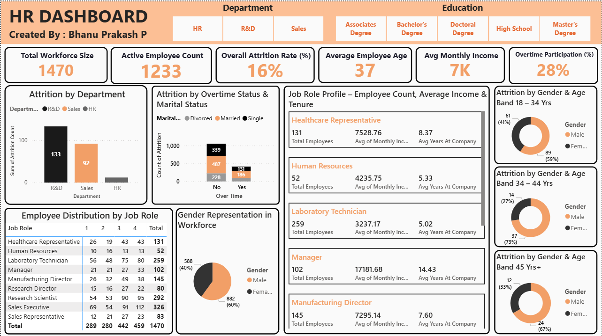

# HR Dashboard – Workforce Insights

🚀 **Turned HR employee data into actionable insights using Power BI + DAX + Excel**

This project analyzes **HR employee demographics, job roles, income, tenure, and attrition** to deliver **business-ready insights** through an **interactive Power BI dashboard**.

---

## 📊 Project Highlights

- **KPI Analysis:** Track Total Workforce, Active Employees, Attrition Rate, Average Age, Income, and Overtime Participation.  
- **Department & Education Filters:** Explore trends across HR, R&D, Sales, and different education levels.  
- **Attrition Insights:** Visualize attrition patterns by department, job role, gender, age, and overtime status.  
- **Job Role Profiling:** Detailed headcount, tenure, and income analysis per role.  
- **Interactive Dashboard:** Includes KPIs, bar charts, treemaps, and drill-down analysis for actionable insights.

---

## 📂 Project Files

- **Dashboard File:** `HR Dashboard.pbix`  
- **Raw Dataset:** `/HR Data.csv`   

💡 **Note:**  
Cleaned datasets are **not uploaded** to keep the repository lightweight.  
All **data cleaning and transformations** can be reviewed directly in the **Power BI file**.

---

## 🖼️ Dashboard Preview

**Page 1: HR Dashboard**  

**Page 2: Data Storytelling**  
![Data Storytelling]

---

## 🔹 Key Insights

1️⃣ **High Attrition in R&D & Sales** → Focus retention programs in these departments  
2️⃣ **Overtime Impact:** Employees working overtime have higher attrition, especially among single and married staff  
3️⃣ **Gender & Age Trends:** Most attrition in **18–34 age group**, predominantly female  
4️⃣ **Job Role Analysis:** Managers have the highest average income and tenure; operational roles like Lab Technicians have higher headcount but shorter tenure  

---

## ⚡ Tech Stack

- **Power BI** – Data Modeling & Interactive Dashboard  
- **DAX** – Calculated Metrics & KPIs  
- **Excel / CSV** – Raw Employee Data  
- **Data Cleaning** – Ensured accurate demographics, income, and tenure data  

---

## 💼 About Me

I am a **Data Analyst & Power BI Enthusiast**, passionate about **data storytelling, HR analytics, and interactive dashboarding**.  
Excited to **connect with professionals** and explore **entry-level Data Analyst roles**!  

**Portfolio:** [Portfolio.com](https://bhanu-prakash-protfolio.vercel.app/)  
**LinkedIn:** [LinkedIn](https://www.linkedin.com/in/pepala-bhanu-prakash-2002m09d14/)  

---

⭐ **If you find this project helpful, please give it a star on GitHub!**
